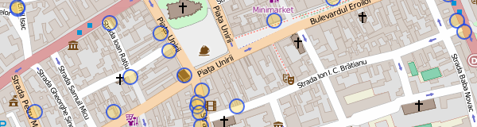
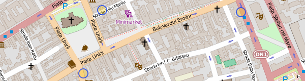
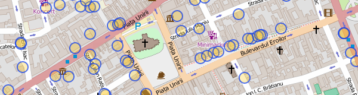
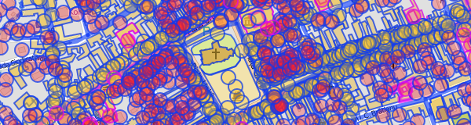
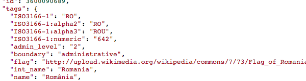

## Overpass - filtrare

http://overpass-turbo.eu/


### filtru după tag
```
node
  [amenity=cafe]
  ({{bbox}});
out;
```



În tab-ul "data" din dreapta putem vedea rezultatul în format OpenStreetMap
XML.

Exercițiu: extrageți
[restaurantele](http://wiki.openstreetmap.org/wiki/Tag:amenity%3Drestaurant),
[hotelurile](http://wiki.openstreetmap.org/wiki/Tag:tourism%3Dhotel) și
[spitalele](http://wiki.openstreetmap.org/wiki/Tag:amenity%3Dhospital) din
zonă.


### query "și"
```
node
  [amenity=cafe]
  [wheelchair=yes]
  ({{bbox}});
out;
```



Exercițiu: extrageți spitalele care au cameră de gardă (`emergency=yes`).


### query "sau"
```
(
  node
    [amenity=cafe]
    ({{bbox}});
  node
    [tourism=hotel]
    ({{bbox}});
);
out;
```


Exercițiu: extrageți toate [cafenelele](http://wiki.openstreetmap.org/wiki/Tag:amenity%3Dcafe), [barurile](http://wiki.openstreetmap.org/wiki/Tag:amenity%3Dbar), [pub-urile](http://wiki.openstreetmap.org/wiki/Tag:amenity%3Dpub) și [cluburile](http://wiki.openstreetmap.org/wiki/Tag:amenity%3Dnightclub).


### expresie regulată
```
node
  [amenity~"cafe|bar|restaurant"]
  ({{bbox}});
out;
```



Exercițiu: La fel ca punctul precedent, scris sub formă de expresie regulată


### query "tot"
```
(
  node({{bbox}});
  <;
);
out meta;
```



Returnează toate datele din regiunea vizibilă. Operatorul `<;` înseamnă "ia
obiectele părinte" (poligoane și relații care conțin noduri din zonă)


### query "unde sunt?"
```
[out:json];
is_in({{center}});
out;
```



Returnează toate poligoanele care conțin centrul hărții vizibile (clădiri,
teren, regiuni administrative)
