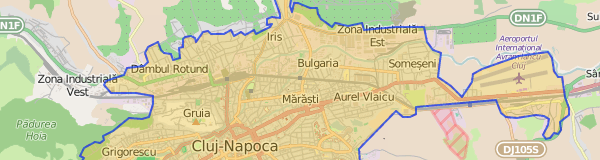
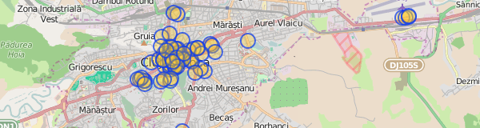

## Overpass - regiuni

Până acum, toate query-urile noastre au fost limitate la `{{bbox}}`, regiunea
vizibilă din hartă. Mai departe vom folosi poligoanele
[place](http://wiki.openstreetmap.org/wiki/Key:place) (localități, regiuni)
pentru a defini limite geografice.


### query după numele unui loc
```
relation
  [place=city]
  [name="Cluj-Napoca"];

>;
out;
```



* `>;` înseamnă "ia obiectele copil" (nodurile care formează poligonul)

Exercițiu: extrageți conturul altor localități.


### limită query la o regiune
```
area[place=city][name="Cluj-Napoca"];

node
  [amenity=cafe]
  (area);
out;
```



Definim `area` ca limitele orașului Cluj și îl folosim ca filtru spațial pentru
noduri.

Exercițiu: extrageți hotelurile din Cluj.


### zone
```
area[place=city][name="Cluj-Napoca"];

(
  way
    [leisure=park]
    (area);
  >;
);
out;
```


Căutăm obiecte de tip "way" poligoane care au tag `leisure=park`.

Multe din rezultatele care apar ca puncte sunt de fapt poligoane, dar sunt
afișate ca puncte, din cauza simplificărilor făcute de viewer-ul din Overpass
Turbo. Datele exportate vor fi de tip poligon.

Exercițiu: extrageți și grădinile (`leisure=garden`) în același query.


### structuri complexe
```
area[place=city][name="Cluj-Napoca"];

(
  relation
    [route=bus]
    [ref=27]
    (area);
  >;
);
out;
```


Plecând de la relația `[route=bus][ref=27]`, cerem toate obiectele copil
(way-uri și noduri, adică traseul și stațiile).

Exercițiu: extrageți magistrala de metrou
[M2](http://www.openstreetmap.org/relation/2947020) din București.


### centrele poligoanelor
```
area[place=city][name="Cluj-Napoca"];

way
  [leisure=park]
  (area);
out center;
```


Nu mai cerem elementele copil de la poligoane (nodurile de pe contur), vrem
doar centrele.

Exercițiu: extrageți centrele localităților din județul Timișoara
(`[place~"city|town|village"]`). Nu uitați să modificați și `area` de căutare.
