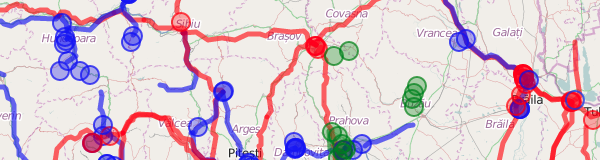

## Overpass Turbo - simbolizare

http://wiki.openstreetmap.org/wiki/Overpass_turbo/MapCSS

### Cafenele, pub-uri
```
area[place=city][name="Cluj-Napoca"];

node[amenity~"^cafe|pub$"](area);
out;

{{style:
  node { symbol-size: 8; }
  node[amenity=cafe] { color: blue; fill-color: blue; }
  node[amenity=pub] { color: green; fill-color: green; }
}}
```


Prima regulă de CSS spune că toate simbolurile au rază 8. Următoarele două
colorează simbolurile în funcție de tag-uri.

La expresia regulată am adăugat regulile `^` și `$` (început și sfârșit de
text), ca să primim rezultate exacte `pub` și `cafe`, fără rezultate de tipul
`amenity=public_building`, care conțin în parte expresia căutată.

Exercițiu: simbolizați spitalele din Cluj. Cele care au cameră de gardă să fie
colorate cu roșu, restul albastru.


### Linie de autobuz
```
area[place=city][name="Cluj-Napoca"];

(
  relation
    [route=bus]
    [ref=27]
    (area);
  >;
);
out;

{{style:
  node { symbol-shape: none; }
  relation node[public_transport=stop_position] {
    symbol-shape: circle; symbol-size: 5;
  }
}}
```


Ascundem toate nodurile, mai puțin cele care fac parte din relație, și sunt
marcate ca stație.

Exercițiu: simbolizați magistrala de metrou M2 din București.


### Rețeaua de înaltă tensiune
```
area[name="România"];

way
  (area)
  [power=line]
  [voltage~"...000"];
out geom;

{{style:
  node[voltage=400000],
  line[voltage=400000]
  { color:red; fill-color: red; }

  node[voltage=220000],
  line[voltage=220000]
  { color:blue; fill-color: blue; }

  node[voltage=110000],
  line[voltage=110000]
  { color:green; fill-color: green; }
}}
```



Linii de înaltă tensiune (110kV, 220kV și 400kV). Expresia regulată filtrează
liniile care au 3 cifre urmate de 3 zero-uri.

Din cauza simplificărilor făcute de Overpass Turbo, la zoom out, unele segmente
de linie sunt reprezentate ca noduri, de aceea regulile de simbolizare operează
și pe noduri și pe linii.

Exercițiu: simbolizați liniile de tensiune din județul Cluj.


### Localități după tip și mărime
```
area[place=county][name="Cluj"];

node(area)[place~"city|town|village"];
out;

{{style:
  node { symbol-size: 2; }
  node[population>100] { symbol-size: 4; }
  node[population>10000] { symbol-size: 8; }
  node[population>100000] { symbol-size: 12; }
  node[place=village] { color: brown; }
  node[place=town] { color: blue; }
  node[place=city] { color: red; }
}}
```


Cuoarea reprezintă tipul localității, mărimea reprezintă populația.

Exercițiu: simbolizați localitățile din alt județ.
