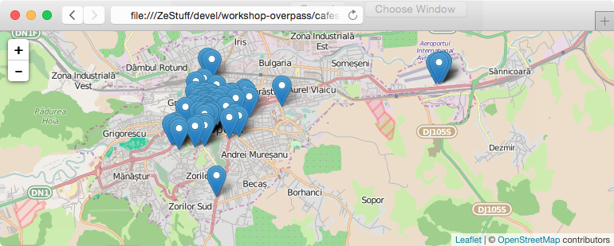

## Overpass - export

Putem salva rezultatele unui query în format GeoJSON. Alternativ, putem
construi o hartă care, la fiecare încărcare, execută un query Overpass și
afișează rezultatele.

### Export GeoJSON

După ce am rulat un query în Overpass Turbo putem exporta rezultatul în format
GeoJSON din meniul "Export". Putem vizualiza și modifica fișierul exportat prin
serviciul [geojson.io]().

**Exercițiu**: Rulați un query din exercțiile anterioare, salvați rezultatul ca
GeoJSON, și încarcați-l în geojson.io.

### Hartă web cu query live

Hartă Leaflet care afișează rezultate din Overpass. Codul este generic,
afișează orice rezultate primim de la Overpass, în urma query-ului. Rezultatele
vor fi tot timpul la zi cu actualizările din OpenStreetMap.

[cafes.html](https://github.com/mgax/workshop-geocj2015-overpass/blob/master/cafes.html)

**Exercițiu**: Salvați local fișierul HTML și deschideți-l în browser.
Înlocuiți query-ul cu diverse query-uri din exercițiile anterioare.

### QGIS

[QGIS](https://www.qgis.org) deschide fișiere GeoJSON ca vector layer. Dacă
vrem să verificăm poziția datelor, putem instala plugin-ul "OpenLayers Plugin",
și din menul "web > OpenLayers Plugin", alegem o hartă ca background. Proiecția
proiectului curent va deveni "EPSG:3857" – Web Mercator – proiecția folosită de
majoritatea slippy map-urilor.

