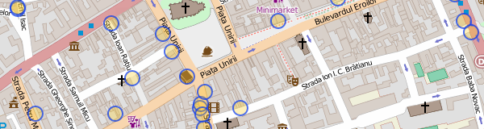
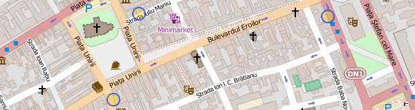
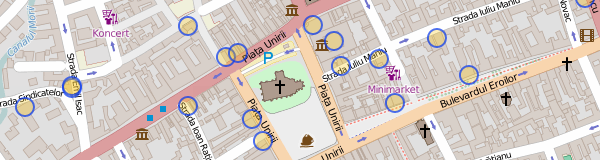
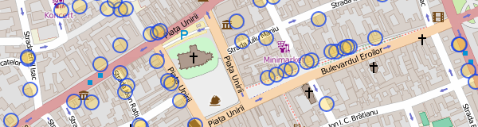
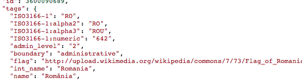

## Overpass - filtrare

[Overpass API](http://wiki.openstreetmap.org/wiki/Overpass_API) este un
serviciu de interogat date în OpenStreetMap. [Overpass
Turbo](http://overpass-turbo.eu/) este interfața pentru rulat query-uri și
vizualizat rezultate.


### filtru după tag
```
node
  [amenity=cafe]
  ({{bbox}});
out;
```



În tab-ul "data" din dreapta putem vedea rezultatul în format OpenStreetMap
XML.

**Exercițiu**: extrageți
[restaurantele](http://wiki.openstreetmap.org/wiki/Tag:amenity%3Drestaurant),
[hotelurile](http://wiki.openstreetmap.org/wiki/Tag:tourism%3Dhotel) și
[spitalele](http://wiki.openstreetmap.org/wiki/Tag:amenity%3Dhospital) din
zonă.


### query "și"
```
node
  [amenity=cafe]
  [wheelchair=yes]
  ({{bbox}});
out;
```



**Exercițiu**: extrageți spitalele care au cameră de gardă (`emergency=yes`).


### query "sau"
```
(
  node
    [amenity=cafe]
    ({{bbox}});
  node
    [tourism=hotel]
    ({{bbox}});
);
out;
```



**Exercițiu**: extrageți toate
[cafenelele](http://wiki.openstreetmap.org/wiki/Tag:amenity%3Dcafe),
[barurile](http://wiki.openstreetmap.org/wiki/Tag:amenity%3Dbar),
[pub-urile](http://wiki.openstreetmap.org/wiki/Tag:amenity%3Dpub) și
[cluburile](http://wiki.openstreetmap.org/wiki/Tag:amenity%3Dnightclub).


### expresie regulată
```
node
  [amenity~"cafe|bar|restaurant"]
  ({{bbox}});
out;
```



**Exercițiu**: La fel ca punctul precedent, scris sub formă de expresie
regulată


### query "tot"
```
(
  node({{bbox}});
  <;
);
out meta;
```


Returnează toate datele din regiunea vizibilă. Operatorul `<;` înseamnă "ia
obiectele părinte" (poligoane și relații care conțin noduri din zonă)


### query "unde sunt?"
```
[out:json];
is_in({{center}});
out;
```



Returnează toate poligoanele care conțin centrul hărții vizibile (clădiri,
teren, regiuni administrative). Am cerut rezultatele în format JSON ca să fie
mai ușor de citit.

## Overpass - regiuni

Până acum, toate query-urile noastre au fost limitate la `{{bbox}}`, regiunea
vizibilă din hartă. Mai departe vom folosi poligoanele
[place](http://wiki.openstreetmap.org/wiki/Key:place) (localități, regiuni)
pentru a defini limite geografice.


### query după numele unui loc
```
relation
  [place=city]
  [name="Cluj-Napoca"];

>;
out;
```


* `>;` înseamnă "ia obiectele copil" (nodurile care formează poligonul)

**Exercițiu**: extrageți conturul altor localități.


### limită query la o regiune
```
area[place=city][name="Cluj-Napoca"];

node
  [amenity=cafe]
  (area);
out;
```


Definim `area` ca limitele orașului Cluj și îl folosim ca filtru spațial pentru
noduri.

**Exercițiu**: extrageți hotelurile din Cluj.


### zone
```
area[place=city][name="Cluj-Napoca"];

(
  way
    [leisure=park]
    (area);
  >;
);
out;
```


Căutăm obiecte de tip "way" poligoane care au tag `leisure=park`.

Multe din rezultatele care apar ca puncte sunt de fapt poligoane, dar sunt
afișate ca puncte, din cauza simplificărilor făcute de viewer-ul din Overpass
Turbo. Datele exportate vor fi de tip poligon.

**Exercițiu**: extrageți și grădinile (`leisure=garden`) în același query.


### structuri complexe
```
area[place=city][name="Cluj-Napoca"];

(
  relation
    [route=bus]
    [ref=27]
    (area);
  >;
);
out;
```


Plecând de la relația `[route=bus][ref=27]`, cerem toate obiectele copil
(way-uri și noduri, adică traseul și stațiile).

**Exercițiu**: extrageți magistrala de metrou
[M2](http://www.openstreetmap.org/relation/2947020) din București.


### centrele poligoanelor
```
area[place=city][name="Cluj-Napoca"];

way
  [leisure=park]
  (area);
out center;
```


Nu mai cerem elementele copil de la poligoane (nodurile de pe contur), vrem
doar centrele.

**Exercițiu**: extrageți centrele aeroporturilor din România (poligoane
`aeroway=aerodrome`).

**Exercițiu**: extrageți centrele localităților din județul Timișoara
(`[place~"city|town|village"]`). Nu uitați să modificați și `area` de căutare.

## Overpass Turbo - simbolizare

Overpass Turbo (interfața de rulat query-uri și vizualizat rezultate) poate să
simbolizeze rezultatul conform unor reguli definite de noi. Sintaxa, MapCSS,
este [explicată pe
wiki](http://wiki.openstreetmap.org/wiki/Overpass_turbo/MapCSS).


### Cafenele, pub-uri
```
area[place=city][name="Cluj-Napoca"];

node[amenity~"^cafe|pub$"](area);
out;

{{style:
  node { symbol-size: 8; }
  node[amenity=cafe] { color: blue; fill-color: blue; }
  node[amenity=pub] { color: green; fill-color: green; }
}}
```


Prima regulă de CSS spune că toate simbolurile au rază 8. Următoarele două
colorează simbolurile în funcție de tag-uri.

La expresia regulată am adăugat regulile `^` și `$` (început și sfârșit de
text), ca să primim rezultate exacte `pub` și `cafe`, fără rezultate de tipul
`amenity=public_building`, care conțin în parte expresia căutată.

**Exercițiu**: simbolizați spitalele din Cluj. Cele care au cameră de gardă să
fie colorate cu roșu, restul albastru.


### Linie de autobuz
```
area[place=city][name="Cluj-Napoca"];

(
  relation
    [route=bus]
    [ref=27]
    (area);
  >;
);
out;

{{style:
  node { symbol-shape: none; }
  relation node[public_transport=stop_position] {
    symbol-shape: circle; symbol-size: 5;
  }
}}
```


Ascundem toate nodurile, mai puțin cele care fac parte din relație, și sunt
marcate ca stație.

**Exercițiu**: simbolizați magistrala de metrou M2 din București.


### Rețeaua de înaltă tensiune
```
area[name="România"];

way
  (area)
  [power=line]
  [voltage~"...000"];
out geom;

{{style:
  node[voltage=400000],
  line[voltage=400000]
  { color:red; fill-color: red; }

  node[voltage=220000],
  line[voltage=220000]
  { color:blue; fill-color: blue; }

  node[voltage=110000],
  line[voltage=110000]
  { color:green; fill-color: green; }
}}
```


Linii de înaltă tensiune (110kV, 220kV și 400kV). Expresia regulată filtrează
liniile care au 3 cifre urmate de 3 zero-uri.

Din cauza simplificărilor făcute de Overpass Turbo, la zoom out, unele segmente
de linie sunt reprezentate ca noduri, de aceea regulile de simbolizare operează
și pe noduri și pe linii.

**Exercițiu**: simbolizați rețeaua de autostrăzi (`highway=motorway`) din
România și colorați fiecare autostradă (A1, A2...) diferit.


### Localități după tip și mărime
```
area[place=county][name="Cluj"];

node(area)[place~"city|town|village"];
out;

{{style:
  node { symbol-size: 2; }
  node[population>100] { symbol-size: 4; }
  node[population>10000] { symbol-size: 8; }
  node[population>100000] { symbol-size: 12; }
  node[place=village] { color: brown; }
  node[place=town] { color: blue; }
  node[place=city] { color: red; }
}}
```


Cuoarea reprezintă tipul localității, mărimea reprezintă populația.

**Exercițiu**: simbolizați localitățile din alt județ.

## Overpass - export

Putem salva rezultatele unui query în format GeoJSON. Alternativ, putem
construi o hartă care, la fiecare încărcare, execută un query Overpass și
afișează rezultatele.


### Export GeoJSON

După ce am rulat un query în Overpass Turbo putem exporta rezultatul în format
GeoJSON din meniul "Export". Putem vizualiza și modifica fișierul exportat prin
serviciul [geojson.io]().


**Exercițiu**: Rulați un query din exercțiile anterioare, salvați rezultatul ca
GeoJSON, și încarcați-l în geojson.io.


### Hartă web cu query live

Hartă Leaflet care afișează rezultate din Overpass. Codul este generic,
afișează orice rezultate primim de la Overpass, în urma query-ului. Rezultatele
vor fi tot timpul la zi cu actualizările din OpenStreetMap.

[parks.html]()


**Exercițiu**: Salvați local fișierul HTML și deschideți-l în browser.
Înlocuiți query-ul cu diverse query-uri din exercițiile anterioare.


### QGIS

[QGIS](https://www.qgis.org) deschide fișiere GeoJSON ca vector layer. Dacă
vrem să verificăm poziția datelor, putem instala plugin-ul "OpenLayers Plugin",
și din menul "web > OpenLayers Plugin", alegem o hartă ca background. Proiecția
proiectului curent va deveni "EPSG:3857" – Web Mercator – proiecția folosită de
majoritatea slippy map-urilor.


