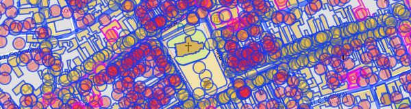
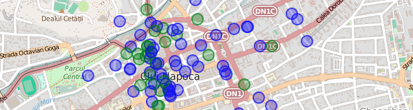



Baza de date OpenStreetMap conține o varietate și cantiate imensă de informații
spațiale, actualizate de voluntari, și disponibile sub o licență liberă. În
acest articol vedem cum putem prelua date din OpenStreetMap filtrând exact ce
avem nevoie.

Vom folosi serviciul [Overpass
API](http://wiki.openstreetmap.org/wiki/Overpass_API), un motor de interogare
pentru baza de date OpenStreetMap. Overpass este un serviciu web pentru
aplicații, de aceea nu îl vom folosi direct, ci vom executa căutări prin
interfața grafică [Overpass Turbo](http://overpass-turbo.eu/).

## Reprezentarea datelor în OpenStreetMap

Datele spațiale, în mod normal, sunt reprezentate folosind câteva tipuri de
geometrie standard: punct, linie, poligon, multipoligon, etc. În OpenStreetMap
datele sunt reprezentate altfel: [node, way,
relation](http://wiki.openstreetmap.org/wiki/Elements).

* *Node* reprezintă un punct în spațiu cu coordonate "latitudine" și
  "longitudine" (WGS84). Poate fi un obiectiv de sine stătător, cum ar fi un
  stâlp de înaltă tensiune, sau poate fi parte dintr-un *way*.

* *Way* este o listă de obiecte *node* și poate reprezenta o linie (de exemplu
  o șosea) sau un inel închis (de exemplu o clădire).

* *Relation* este o colecție de *node*, *way* și *relation*, și reprezintă
  obiecte mai complexe. De exemplu, o șosea compusă din mai multe segmente
  lipite, o clădire cu o curte interioară, sau traseul unui autobuz, unde
  drumul e reprezentat prin *way*-uri și stațiile sunt reprezentate prin
  *node*-uri).

Orice obiect (*node*, *way*, *relation*) poate avea
[tag-uri](http://wiki.openstreetmap.org/wiki/Tags) atașate. Tag-urile ne spun
ce reprezintă acel obiect. De exemplu, un stâlp de înaltă tensiune va avea
tag-ul [power=tower](http://wiki.openstreetmap.org/wiki/Tag:power%3Dtower)
(cheia `power` și valoarea `tower`). Aceleași noduri pot face parte dintr-un
*way* care reprezintă o linie de înaltă tensiune și care va avea tag-ul
[power=line](http://wiki.openstreetmap.org/wiki/Tag:power%3Dline). Linia poate
avea alte tag-uri, de exemplu
[voltage=](http://wiki.openstreetmap.org/wiki/Key:voltage)400000, pentru linii
de 400KV. Tag-urile sunt documentate pe wiki-ul OpenStreetMap în secțiunea [Map
Features](http://wiki.openstreetmap.org/wiki/Map_Features). Ne vom folosi de
aceste tag-uri ca să filtrăm datele care ne interesează.

## Filtrare

### filtru după tag

    node
      [amenity=cafe]
      ({{bbox}});
    out;

În tab-ul "data" din dreapta putem vedea rezultatul în format OpenStreetMap
XML.

**Exercițiu**: extrageți
[restaurantele](http://wiki.openstreetmap.org/wiki/Tag:amenity%3Drestaurant),
[hotelurile](http://wiki.openstreetmap.org/wiki/Tag:tourism%3Dhotel) și
[spitalele](http://wiki.openstreetmap.org/wiki/Tag:amenity%3Dhospital) din
zonă.

### query "și"

    node
      [amenity=cafe]
      [wheelchair=yes]
      ({{bbox}});
    out;

**Exercițiu**: extrageți spitalele care au cameră de gardă (`emergency=yes`).

### query "sau"

    (
      node
        [amenity=cafe]
        ({{bbox}});
      node
        [tourism=hotel]
        ({{bbox}});
    );
    out;

**Exercițiu**: extrageți toate
[cafenelele](http://wiki.openstreetmap.org/wiki/Tag:amenity%3Dcafe),
[barurile](http://wiki.openstreetmap.org/wiki/Tag:amenity%3Dbar),
[pub-urile](http://wiki.openstreetmap.org/wiki/Tag:amenity%3Dpub) și
[cluburile](http://wiki.openstreetmap.org/wiki/Tag:amenity%3Dnightclub).

### expresie regulată

    node
      [amenity~"cafe|bar|restaurant"]
      ({{bbox}});
    out;

**Exercițiu**: La fel ca punctul precedent, scris sub formă de expresie
regulată

### query "tot"

    (
      node({{bbox}});
      <;
    );
    out meta;

Returnează toate datele din regiunea vizibilă. Operatorul `<;` înseamnă "ia
obiectele părinte" (poligoane și relații care conțin noduri din zonă)

### query "unde sunt?"

    [out:json];
    is_in({{center}});
    out;

Returnează toate poligoanele care conțin centrul hărții vizibile (clădiri,
teren, regiuni administrative). Am cerut rezultatele în format JSON ca să fie
mai ușor de citit.

## Regiuni

Până acum, toate query-urile noastre au fost limitate la `{{bbox}}`, regiunea
vizibilă din hartă. Mai departe vom folosi poligoanele
[place](http://wiki.openstreetmap.org/wiki/Key:place) (localități, regiuni)
pentru a defini limite geografice.

### query după numele unui loc

    relation
      [place=city]
      [name="Cluj-Napoca"];

    >;
    out;

* `>;` înseamnă "ia obiectele copil" (nodurile care formează poligonul)

**Exercițiu**: extrageți conturul altor localități.

### limită query la o regiune

    area[place=city][name="Cluj-Napoca"];

    node
      [amenity=cafe]
      (area);
    out;

Definim `area` ca limitele orașului Cluj și îl folosim ca filtru spațial pentru
noduri.

**Exercițiu**: extrageți hotelurile din Cluj.

### zone

    area[place=city][name="Cluj-Napoca"];

    (
      way
        [leisure=park]
        (area);
      >;
    );
    out;

Căutăm obiecte de tip "way" poligoane care au tag `leisure=park`.

Multe din rezultatele care apar ca puncte sunt de fapt poligoane, dar sunt
afișate ca puncte, din cauza simplificărilor făcute de viewer-ul din Overpass
Turbo. Datele exportate vor fi de tip poligon.

**Exercițiu**: extrageți și grădinile (`leisure=garden`) în același query.

### structuri complexe

    area[place=city][name="Cluj-Napoca"];

    (
      relation
        [route=bus]
        [ref=27]
        (area);
      >;
    );
    out;

Plecând de la relația `[route=bus][ref=27]`, cerem toate obiectele copil
(way-uri și noduri, adică traseul și stațiile).

**Exercițiu**: extrageți magistrala de metrou
[M2](http://www.openstreetmap.org/relation/2947020) din București.

### centrele poligoanelor

    area[place=city][name="Cluj-Napoca"];

    way
      [leisure=park]
      (area);
    out center;

Nu mai cerem elementele copil de la poligoane (nodurile de pe contur), vrem
doar centrele.

**Exercițiu**: extrageți centrele aeroporturilor din România (poligoane
`aeroway=aerodrome`).

**Exercițiu**: extrageți centrele localităților din județul Timișoara
(`[place~"city|town|village"]`). Nu uitați să modificați și `area` de căutare.

## Simbolizare

Overpass Turbo (interfața de rulat query-uri și vizualizat rezultate) poate să
simbolizeze rezultatul conform unor reguli definite de noi. Sintaxa, MapCSS,
este [explicată pe
wiki](http://wiki.openstreetmap.org/wiki/Overpass_turbo/MapCSS).

### Cafenele, pub-uri

    area[place=city][name="Cluj-Napoca"];

    node[amenity~"^cafe|pub$"](area);
    out;

    {{style:
      node { symbol-size: 8; }
      node[amenity=cafe] { color: blue; fill-color: blue; }
      node[amenity=pub] { color: green; fill-color: green; }
    }}

Prima regulă de CSS spune că toate simbolurile au rază 8. Următoarele două
colorează simbolurile în funcție de tag-uri.

La expresia regulată am adăugat regulile `^` și `$` (început și sfârșit de
text), ca să primim rezultate exacte `pub` și `cafe`, fără rezultate de tipul
`amenity=public_building`, care conțin în parte expresia căutată.

**Exercițiu**: simbolizați spitalele din Cluj. Cele care au cameră de gardă să
fie colorate cu roșu, restul albastru.

### Linie de autobuz

    area[place=city][name="Cluj-Napoca"];

    (
      relation
        [route=bus]
        [ref=27]
        (area);
      >;
    );
    out;

    {{style:
      node { symbol-shape: none; }
      relation node[public_transport=stop_position] {
        symbol-shape: circle; symbol-size: 5;
      }
    }}

Ascundem toate nodurile, mai puțin cele care fac parte din relație, și sunt
marcate ca stație.

**Exercițiu**: simbolizați magistrala de metrou M2 din București.

### Rețeaua de înaltă tensiune

    area[name="România"];

    way
      (area)
      [power=line]
      [voltage~"...000"];
    out geom;

    {{style:
      node[voltage=400000],
      line[voltage=400000]
      { color:red; fill-color: red; }

      node[voltage=220000],
      line[voltage=220000]
      { color:blue; fill-color: blue; }

      node[voltage=110000],
      line[voltage=110000]
      { color:green; fill-color: green; }
    }}

Linii de înaltă tensiune (110kV, 220kV și 400kV). Expresia regulată filtrează
liniile care au 3 cifre urmate de 3 zero-uri.

Din cauza simplificărilor făcute de Overpass Turbo, la zoom out, unele segmente
de linie sunt reprezentate ca noduri, de aceea regulile de simbolizare operează
și pe noduri și pe linii.

**Exercițiu**: simbolizați rețeaua de autostrăzi (`highway=motorway`) din
România și colorați fiecare autostradă (A1, A2...) diferit.

### Localități după tip și mărime

    area[place=county][name="Cluj"];

    node(area)[place~"city|town|village"];
    out;

    {{style:
      node { symbol-size: 2; }
      node[population>100] { symbol-size: 4; }
      node[population>10000] { symbol-size: 8; }
      node[population>100000] { symbol-size: 12; }
      node[place=village] { color: brown; }
      node[place=town] { color: blue; }
      node[place=city] { color: red; }
    }}

Cuoarea reprezintă tipul localității, mărimea reprezintă populația.

**Exercițiu**: simbolizați localitățile din alt județ.

## Export

Putem salva rezultatele unui query în format GeoJSON. Alternativ, putem
construi o hartă care, la fiecare încărcare, execută un query Overpass și
afișează rezultatele.

### Export GeoJSON

După ce am rulat un query în Overpass Turbo putem exporta rezultatul în format
GeoJSON din meniul "Export". Putem vizualiza și modifica fișierul exportat prin
serviciul [geojson.io]().

**Exercițiu**: Rulați un query din exercțiile anterioare, salvați rezultatul ca
GeoJSON, și încarcați-l în geojson.io.

### Hartă web cu query live

Hartă Leaflet care afișează rezultate din Overpass. Codul este generic,
afișează orice rezultate primim de la Overpass, în urma query-ului. Rezultatele
vor fi tot timpul la zi cu actualizările din OpenStreetMap.

[parks.html]()

**Exercițiu**: Salvați local fișierul HTML și deschideți-l în browser.
Înlocuiți query-ul cu diverse query-uri din exercițiile anterioare.

### QGIS

[QGIS](https://www.qgis.org) deschide fișiere GeoJSON ca vector layer. Dacă
vrem să verificăm poziția datelor, putem instala plugin-ul "OpenLayers Plugin",
și din menul "web > OpenLayers Plugin", alegem o hartă ca background. Proiecția
proiectului curent va deveni "EPSG:3857" – Web Mercator – proiecția folosită de
majoritatea slippy map-urilor.

